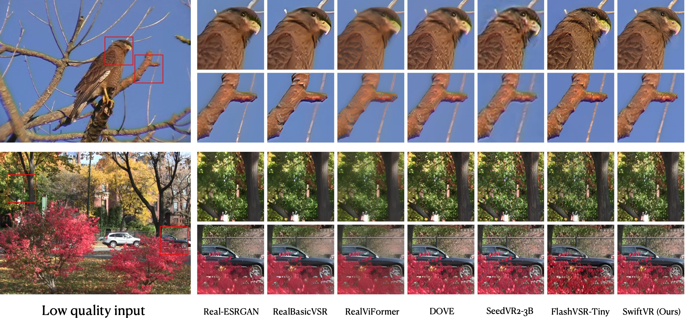

<h1 align="center">SwiftVR: Real-Time One-Step Generative Video Restoration</h1>

<p align="center"></p>

> **SwiftVR** is the first generative video restoration model to reach **real-time 1080p streaming on a consumer-grade GPU** (≈26 FPS on a single RTX 5090), sustains **31 FPS at QHD (2560×1440)** and **14 FPS at 4K (3840×2160)** on a single H100, and streams at resolutions where every compared diffusion-based VR baseline runs out of memory.

<p>
  <a href="https://arxiv.org/abs/2606.09516"></a>
  <a href="https://h-oliday.github.io/SwiftVR"></a>
  <a href="https://huggingface.co/H-oliday/SwiftVR"></a>
  <a href="https://github.com/H-oliday/SwiftVR/blob/main/LICENSE"></a>
</p>

## Updates

* [2026/06] Release the inference code and pretrained weights 🎉

## ✨ Highlights

* **Mask-free shifted-window self-attention (MFSWA).** Each spatial window is **pre-gathered into a dense tensor**, so every attention call reduces to a single standard scaled-dot-product (SDPA) call — *no attention mask, cyclic shift, or padding ever enters the graph*. This gives a **1.62× throughput gain over its full-attention teacher** at essentially identical quality, with **no dedicated sparse kernel**.
* **Restoration-aware Autoencoder (ReAE).** A lightweight encoder–decoder jointly fine-tuned with the DiT in pixel space removes the heavy-3D-VAE / tiled-decoding bottleneck.
* **Causal chunk-wise streaming.** A minimal causal protocol (no rolling KV cache, no overlapped DiT inference) bounds the temporal axis, confining the residual (\mathcal{O}(N^2)) cost to the spatial axes.


## 📊 Results

### Efficiency at 2560×1440

Single H100, causal streaming, 24 frames.

| Metric | DOVE (tile) | SeedVR2-3B (tile)| FlashVSR-Tiny | **SwiftVR (Ours)** |
|---|:---:|:---:|:---:|:---:|
| Avg. Time (s) ↓ | 27.615 | 17.320 | 2.493 | 0.766 |
| FPS ↑ | 0.85 | 1.39 | 9.61 | 31.32 |
| Peak Mem. (GB) ↓ | 59.24 | 35.35 | 34.35 | 38.01 |

> At **3840×2160**, every compared diffusion-based VR baseline **OOMs** on a single H100; SwiftVR sustains **14 FPS**.

### Qualitative comparison



## 🛠 Installation

```bash
git clone https://github.com/H-oliday/SwiftVR.git
cd SwiftVR

conda create -n swiftvr python=3.10 -y
conda activate swiftvr

# Install PyTorch matching your CUDA toolkit first, e.g. CUDA 12.4:
pip install torch==2.10.0 torchvision==0.25.0 --index-url https://download.pytorch.org/whl/cu124

# Install SwiftVR (editable) and its dependencies:
pip install -e .
```

<details>
<summary><b>Hardware notes</b></summary>

* **Server:** single H100-80G reproduces the QHD/4K numbers above.
* **Consumer:** single RTX 5090 reaches ≈26 FPS at 1080p with the *same checkpoint* (default PyTorch SDPA path, bfloat16, causal chunk protocol).
* No hardware-specific retraining or kernel rewrite is required on any platform.

</details>

## 🗂 Model Zoo

| Model Name | Date    | Backbone       | Link                                                  |
| ---------- | ------- | -------------- | ----------------------------------------------------- |
| SwiftVR        | 2026.06 | Wan2.2-TI2V-5B | [🤗 HuggingFace](https://huggingface.co/H-oliday/SwiftVR) |

```bash
huggingface-cli download H-oliday/SwiftVR --local-dir checkpoints/
```

Expected checkpoint layout, where `checkpoints/` is the directory passed to `from_pretrained`:

```text
checkpoints/
├── reae.safetensors             # Restoration-aware Autoencoder weights
├── prompt_embedding.safetensors # precomputed empty-prompt text embedding, key: "prompt_emb"
└── transformer/                 # diffusers-format DiT
    ├── config.json
    └── diffusion_pytorch_model.safetensors
```

## 🚀 Quick Start

### Python API

```python
from swiftvr import SwiftVRPipeline

pipe = SwiftVRPipeline.from_pretrained("checkpoints/").to("cuda", dtype="bfloat16")

pipe.restore_video("low_quality.mp4", "restored.mp4", upscale=4)
```

`restore_video` also accepts an image folder as input and can write a PNG sequence with `png_save=True`.

Tunable knobs include:

* `clip_len`: middle chunk size, multiple of 4
* `dit_overlap`: overlap for DiT inference
* `fps`: output video frame rate
* `quality`: 0–100, mapped to x265 CRF
* `queue_size`: pipeline queue size

### Streaming

Causal, chunk-by-chunk restoration without future frames.

```python
session = pipe.stream(clip_len=24, resolution=(1920, 1080))

for lq_chunk in read_chunks("low_quality.mp4", n=24):   # lq_chunk: [T, H, W, 3] uint8
    hq = session.step(lq_chunk)                         # [1, T', 3, H', W'] in [0, 1], or None if buffered
    if hq is not None:
        write(hq)

tail = session.flush()                                  # flush the final buffered frames
```

### Command line

```bash
python scripts/inference.py \
  --input low_quality.mp4 \
  --output restored.mp4 \
  --checkpoint checkpoints/ \
  --upscale 4 \
  --clip-len 24 \
  --dtype bfloat16
```

Use `--png` to write a PNG sequence.

## 📁 Repository Structure

```text
SwiftVR/
├── README.md
├── LICENSE
├── requirements.txt
├── setup.py
├── scripts/
│   └── inference.py              # CLI entry point, thin wrapper over SwiftVRPipeline
└── swiftvr/
    ├── __init__.py               # exports SwiftVRPipeline
    ├── pipeline.py               # SwiftVRPipeline: from_pretrained / to / restore_video / stream
    ├── runner.py                 # four-stage pipelined runner: reader → H2D → GPU → writer
    ├── io.py                     # frame reading, GPU preprocessing, mp4 / PNG writing
    ├── models/
    │   ├── reae.py               # Restoration-aware Autoencoder
    │   └── transformer.py        # DiT + mask-free shifted-window self-attention
    └── streaming/
        ├── chunk.py              # fixed-size causal chunk protocol
        ├── tae.py                # streaming autoencoder with causal boundary state
        └── dit.py                # one-step streaming DiT with fixed timestep and RoPE offsets
```

## 🙏 Acknowledgements

SwiftVR builds on [Wan2.2-TI2V-5B](https://github.com/Wan-Video), the lightweight autoencoder [TAEHV](https://github.com/madebyollin/taehv), and the [RealBasicVSR](https://github.com/ckkelvinchan/RealBasicVSR) degradation pipeline.

We thank the authors of [DOVE](https://github.com/zhengchen1999/DOVE), [SeedVR2](https://github.com/ByteDance-Seed/SeedVR), and [FlashVSR](https://github.com/OpenImagingLab/FlashVSR) for releasing strong baselines, and the [UltraVideo](https://huggingface.co/datasets/APRIL-AIGC/UltraVideo) team for the training corpus.

## 📜 License

SwiftVR is released under the **Apache License 2.0**.

Copyright 2026 SwiftVR Authors.

Licensed under the Apache License, Version 2.0. You may obtain a copy of the License at:

https://www.apache.org/licenses/LICENSE-2.0

Unless required by applicable law or agreed to in writing, this project is distributed on an **"AS IS" BASIS**, without warranties or conditions of any kind, either express or implied. See the [LICENSE](./LICENSE) file for the full license text.


## Contact

If you have any questions, feel free to reach out:

* Email: [kakibluee@gmail.com](mailto:kakibluee@gmail.com)

<div align="center">
<sub>If SwiftVR is useful to your research or product, please consider giving it a ⭐.</sub>
</div>
